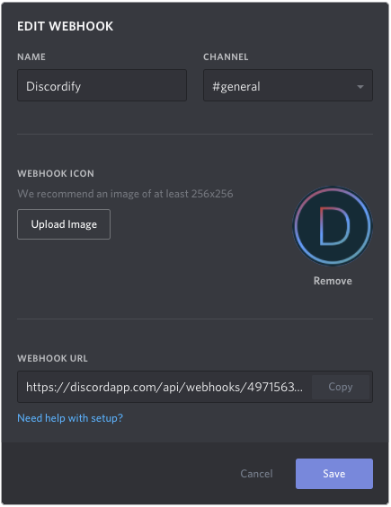

# 

Discordify is a wrapper to execute UNIX shell commands and notify a channel in either Slack or Discord about the results.

### Installation

1. Install this package using pip:
    `pip install https://github.com/OwnHeroNet/discordify.git`
2. Link/Copy wrappers to executable locations on `$PATH`, e.g. `/usr/local/bin/discordify`.

    Alternatively, you can set up an alias: `alias discordify="python -m discordify"`
3. Add a config for a specific webhook to the global or local config (see below).

### Usage

```bash
# wrap my_tool executable in discordiy
discordify my_tool

# wrap my_tool executable in discordiy
discordify my_tool | tee -f log

# this also supports pipes
cat /tmp/socket | discordify process_input >/var/log/something
```

### Configuration file

The configuration stack is evaluated as follows:

- Global: `/etc/discordify.conf`
- Local: `${HOME}/.discordify.conf`
- Instance: command line opts

All configuration options are optional, _except_ for webhook.

The configuration file format is `JSON` and comes with the following parameters.
If the `user_email` is set, but `user_icon` isn't, we infer a gravatar link
automatically. The default thumbnail icon is the Discordify logo.

The footer usually contains "via `$HOSTNAME`".

Default color is solarized red.

```json
{
    "user_name": "Your Name",
    "user_email": "Your Email Address",
    "user_url": "Your Website Address",
    "thumbnail": "https://path.to.your/image.png",
    "color": "0xD11C24",
    "title": "Discordify Notification",
    "webhook": "https://discordapp.com/api/webhooks/id/token"
}
```

For a full list of supported options see `discordify --help`.

### Getting the webhook url

Below you see the user interface for adding webhooks in Discord.
Either go to [Server Settings] -> [Webhooks] -> [Create Webhook] and configure a new webhook or go to
[Edit Channel] -> [Webhooks] -> [Create Webhook].




Copy the webhook URL and paste it in your Discordify configuration file or use it on the commandline
as `discordify --webhook 'https://your-webhook.example'`.
